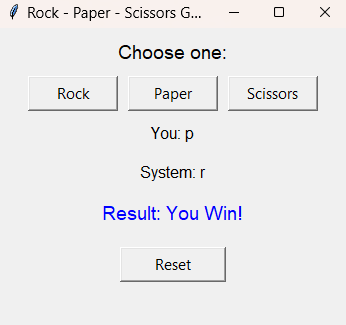

# Rock-Paper-Scissors-Game-with-Python-GUI
This is a simple Rock-Paper-Scissors game built with Python using Tkinter for the GUI.
این یک بازی ساده سنگ-کاغذ-قیچی است که با پایتون و کتابخانه Tkinter ساخته شده است و دارای رابط گرافیکی است.
### Features
- Clickable buttons for Rock, Paper, Scissors
- Display user's choice, system's choice, and game result
- Reset button to start over
- Easy to run with Python 3.x
- 
- ### How to run
1. Make sure Python 3.x and Tkinter are installed.
### ویژگی‌ها
- دکمه‌های قابل کلیک برای انتخاب سنگ، کاغذ و قیچی
- نمایش انتخاب کاربر، انتخاب سیستم و نتیجه بازی
- دکمه Reset برای شروع دوباره
- اجرا آسان با پایتون ۳

### روش اجرا
1. اطمینان حاصل کنید که Python 3.x و Tkinter نصب شده‌اند.
### Screenshot

